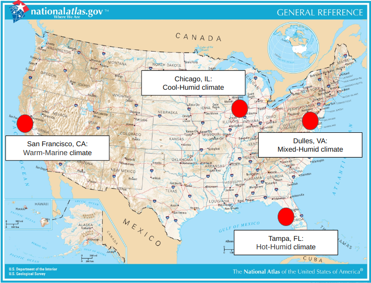
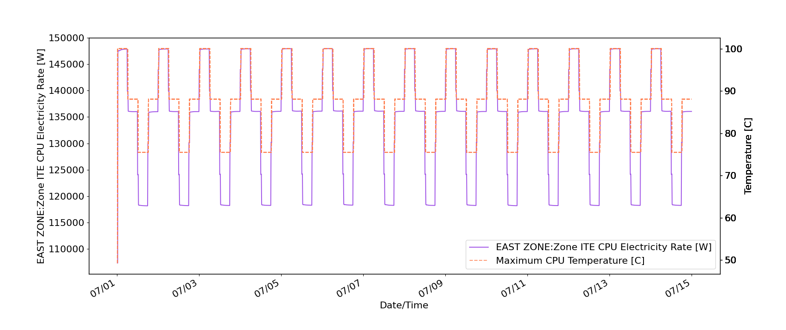
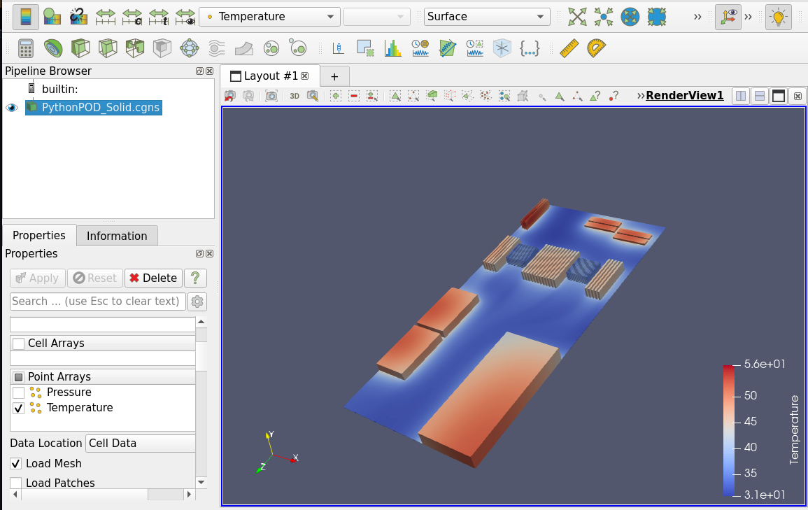

# MOSTCOOL

## Requirements/Tested on:

1. Ubuntu 22.04 with administrator access (Also works on Virtual Machines). If you are using Windows and need to install a Virtual Machine, please follow these instructions ([link](https://github.com/NREL/CoolerChips/blob/main/Resources/MOSTCOOL%20Windows%20Instructions.docx)).

2. At least Quad Core CPU

3. At least 16 GB RAM

4. At least 4 GB hard disk space

## How to run:

1. Install docker in your computer:

https://docs.docker.com/engine/install/

2. Pull our latest stable image:

`docker pull ghcr.io/nrel/mostcool:v1.1.0`

3. Give docker permission to display it's GUI app on host. This step must be repeated each time the computer/virtual machine is restarted: 
`xhost +local:docker`

4. Run the container:

`docker run --network host --env="DISPLAY=${DISPLAY}" --volume="/tmp/.X11-unix:/tmp/.X11-unix:rw" mostcool`

5. You should see the app pop up:

## Sample results:

Simulation outputs:

Results from Paraview:

## Individual Model Documentation:

1. Thermal model documentation can be found in the repo root as [NEITcool DOCUMENTATION.pdf](https://github.com/NREL/CoolerChips/blob/gui/NEITcool%20DOCUMENTATION.pdf).

2. EnergyPlus documentation can be found [here](https://energyplus.net/documentation).

3. EnergyPlus Python API Documentation can be found [here](https://energyplus.readthedocs.io/en/latest/api.html).
